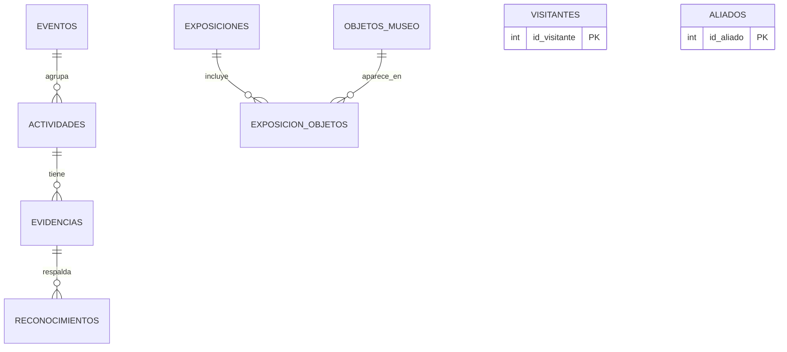

# Diagrama entidad-relación (propuesta)

```mermaid
erDiagram
  EVENTOS ||--o{ ACTIVIDADES : agrupa
  ACTIVIDADES ||--o{ EVIDENCIAS : tiene
  EVIDENCIAS ||--o{ RECONOCIMIENTOS : respalda
  EXPOSICIONES ||--o{ EXPOSICION_OBJETOS : incluye
  OBJETOS_MUSEO ||--o{ EXPOSICION_OBJETOS : aparece_en
  VISITANTES { int id_visitante PK }
  ALIADOS { int id_aliado PK }
```

`visitantes` y `aliados` no tienen relaciones en esta versión; se conectarán cuando la guía del docente defina su uso.
